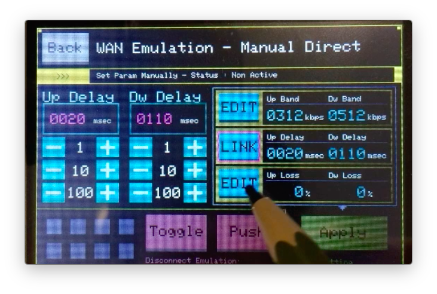

EM-uNetPi - Emulation Network Tool for Raspberry Pi
==================================================================================================

This is the 'EM-uNetPi' network debug tool and is released in open source under MIT License.

- All the needed documentation is in the /docs folder.
- The completed image file can be obtained from the relsease tab.

To get started, please read the /docs/FirstStep.md

OVERVIEW
--------------------------------------------------------------------------------------------------

By using EM-uNetPi, you can perform the following line simulation.

- network bandwidth simulation
- network delay simulation
- packet loss simulation
- disconnections simulation
- symmetric-NAT simulation

Further, these simulations can be performed by the following method.

- select preset params
- set parameter directly
- set parameter by api
- replay recorded delay-data ( * temporarily unavailable )

The figure below is a demonstration screen in direct designation mode.

LICENSE
--------------------------------------------------------------------------------------------------

'EM-uNetPi' is released under MIT License. Please refer LICENSE file for detail.
