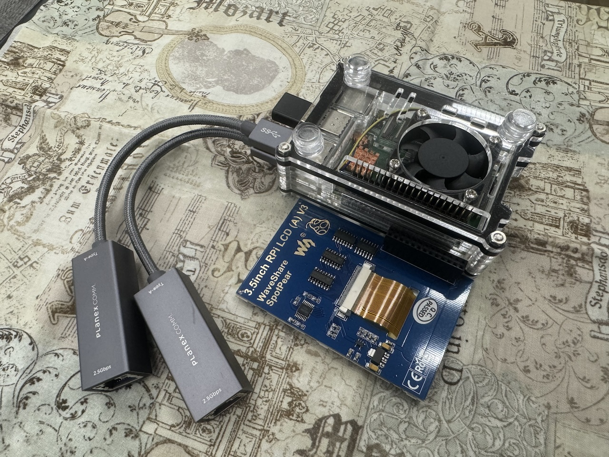

EM-uNetPi 利用ガイド
==================================================================================================

概要
--------------------------------------------------------------------------------------------------

従来、専門的なツールが必要だった回線エミュレーションを、カジュアルに行えるようにするためのツール<br />
\ Network Debug のお楽しみはこれからだ！ /

このツールを使用するには二つの方法があります。

- 1. 完成イメージをreleaseタブから取得しSDカードに焼き、組み立てた完成ハードに刺す
- 2. [こちらのビルド手順](ManualBuild.md) を参考に素のRaspbianから構築する。

特にこだわりがない場合、前者を奨励します。また、パーツに関しては[こちら](PartsList.md)を参考に一式揃えてください。

ハードウェアの組立方法
--------------------------------------------------------------------------------------------------

USB機器は差し込み、タッチパネルはGPIOのピンに沿って刺すだけです。




接続方法
--------------------------------------------------------------------------------------------------

ネットワークケーブルの配線方法は下図の通りです。配線後、起動してください。

クライアントは、有線/無線いずれでも接続が可能です。


> 注1: 図解する際に紛らわしかったので抜いていますが、実際には、空いているポートに5GHz向けのWiFiアダプタが刺さります。

> 注2: クライアント接続用ポートと管理ポートは、RaspberryPi 3B/3B+ の違いやロットの違いで、逆になる可能性があります。接続して、DHCPによるIP払い出しがされる方が、クライアント接続用ポートになります。

起動方法
--------------------------------------------------------------------------------------------------

電源を入れると、1分程度でスプラッシュスクリーン、操作コンソールが表示されます。

操作はタッチパネルによるタッチ入力で行います。

終了方法
--------------------------------------------------------------------------------------------------

Setting > MISC から Shutdown を押し、反応が無くなったら、電源を切ってください。

> この手順を踏まずに強制的に電源を切断 => 再投入した場合、起動時に数分かかる場合があります。

基本的な使用法
--------------------------------------------------------------------------------------------------

モードセレクトの左側のManual Modeの

- Preset Mode
- Direct Mode

が帯域/遅延/パケットロスト/切断をシミュレーションする基本的なモードです。

前者はプリセット値から選択する簡易モードで、後者は直接値を指定するモードです。

API Mode
--------------------------------------------------------------------------------------------------

このモードに入ると、管理ポートに任意のJsonをUDPで送ることにより、帯域/遅延/パケットロスト/切断を制御できるようになります。

Jsonの形式や送信サンプルについては、tools/WanemCtl.php を参照してください。

Replay Mode
--------------------------------------------------------------------------------------------------

端末で記録した遅延データを読み込んで、時系列で再現するモードです。

諸般の事情で、現在一時的に使用不可能になっています。

Setting
--------------------------------------------------------------------------------------------------

諸々設定の変更ができます。一部設定は変更後、rebootしないと反映されないため注意

- APの2.4GHz/5GHz設定切替
- NAPTモードのSymmetric切替
- 帯域シミュレーション時のパケット制御方式（Policing/Shaping）切替

その他
--------------------------------------------------------------------------------------------------

### 管理ポートからのログインについて

完成イメージで動作しているものに対して、sshログインしたい場合、<br />
デフォルトで下記のアドレス/ユーザ設定で、管理ポートからログインできます。

- 管理ポートアドレス： 192.168.31.10
- ユーザ：user
- パスワード：password

### Proxy環境での動作について

起動そのものは、HTTPS Proxy を設定することで可能になります。

起動時の引数として与えれば、HTTPS Proxyを使用するモードになるので、<br />
下記、ファイルを修正した上で、再起動してください。

なお、必要に応じて、配下のクライアントのProxy設定等も必要になります。

#### /home/pi/.bash_profile

proxyオプションを追加して、Https Proxy Server を指定する。

```
sudo python EM-uNetPi/Wanem.py -proxy <[protocol://][user@password]proxyhost[:port]>
```

#### /etc/dhcp/dhcpd.conf

クライアントに配布するDNS Serverがデフォルトのままではダメな場合は、こちらのファイルも要修正。

```
subnet 192.168.20.0 netmask 255.255.255.0 {
authoritative;
option routers 192.168.20.1;
option broadcast-address 192.168.20.255;
option subnet-mask 255.255.255.0;
option domain-name "EM-NetPi";
option domain-name-servers <Your Primary DNS>,<Your Secondary DNS>;
default-lease-time 600;
max-lease-time 7200;
range 192.168.20.101 192.168.20.254;
}

subnet 192.168.21.0 netmask 255.255.255.0 {
authoritative;
option routers 192.168.21.1;
option broadcast-address 192.168.21.255;
option subnet-mask 255.255.255.0;
option domain-name "EM-NetPi";
option domain-name-servers <Your Primary DNS>,<Your Secondary DNS>;
default-lease-time 600;
max-lease-time 7200;
range 192.168.21.101 192.168.21.254;
}
```
