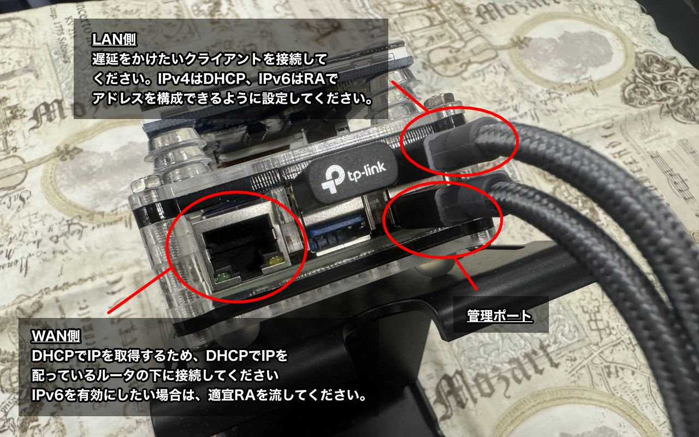

EM-uNetPi 利用ガイド
==================================================================================================

概要
--------------------------------------------------------------------------------------------------

従来、専門的なツールが必要だった回線エミュレーションを、カジュアルに行えるようにするためのツール 
\ Network Debug のお楽しみはこれからだ！ /

このツールを使用するには二つの方法があります。

- 1. 完成イメージをreleaseタブから取得しSDカードに焼き、組み立てた完成ハードに刺す
- 2. [こちらのビルド手順](ManualBuild.md) を参考に素の Raspberry Pi OS から構築する。

特にこだわりがない場合、前者を奨励します。また、パーツに関しては [こちら](PartsList.md) を参考に一式揃えてください。

ハードウェアの組立方法
--------------------------------------------------------------------------------------------------

USB機器は差し込み、タッチパネルはGPIOのピンに沿って刺すだけです。

> USB機器の接続ポートは次の項目に従ってください。適当に刺すと、うまく認識しない可能性があります。

接続方法
--------------------------------------------------------------------------------------------------

ネットワークケーブルの配線方法は下図の通りです。配線後、起動してください。

クライアントは、有線/無線いずれでも接続が可能です。

> 以前の Raspberry 3 向けの配線とは、LAN / 管理ポートが逆位置になっているので、注意してください。
>
> 組み立ての項目にも書いた通り、刺すポートを間違えるとデバイスをうまく認識しないことがあります。
>
> 認識に失敗している場合、起動画面でエラーとなり、起動に失敗します。

起動方法
--------------------------------------------------------------------------------------------------

電源を入れると、1分程度でスプラッシュスクリーン、操作コンソールが表示されます。

操作はタッチパネルによるタッチ入力で行います。

終了方法
--------------------------------------------------------------------------------------------------

Setting > MISC から Shutdown を押し、反応が無くなったら、電源を切ってください。

> この手順を踏まずに強制的に電源を切断 => 再投入した場合、起動時に数分かかる場合があります。

基本的な使用法
--------------------------------------------------------------------------------------------------

モードセレクトの左側のManual Modeの

- Preset Mode
- Direct Mode

が帯域/遅延/パケットロスト/切断をシミュレーションする基本的なモードです。

前者はプリセット値から選択する簡易モードで、後者は直接値を指定するモードです。

API Mode
--------------------------------------------------------------------------------------------------

このモードに入ると、管理ポートに任意のJsonをUDPで送ることにより、帯域/遅延/パケットロスト/切断を制御できるようになります。

Jsonの形式や送信サンプルについては、tools/WanemCtl.php を参照してください。

Replay Mode
--------------------------------------------------------------------------------------------------

端末で記録した遅延データを読み込んで、時系列で再現するモードです。

諸般の事情で、現在一時的に使用不可能になっています。

Setting
--------------------------------------------------------------------------------------------------

諸々設定の変更ができます。一部設定は変更後、rebootしないと反映されないため注意

- APの2.4GHz/5GHz設定切替
- IPv6モードの切替
- NAPTモードのSymmetric切替
- 帯域シミュレーション時のパケット制御方式（Policing/Shaping）切替

その他
--------------------------------------------------------------------------------------------------

### 管理ポートからのログインについて

完成イメージで動作しているものに対して、sshログインしたい場合、 
デフォルトで下記のアドレス/ユーザ設定で、管理ポートからログインできます。

- 管理ポートアドレス： 192.168.31.67
- ユーザ：user
- パスワード：password
