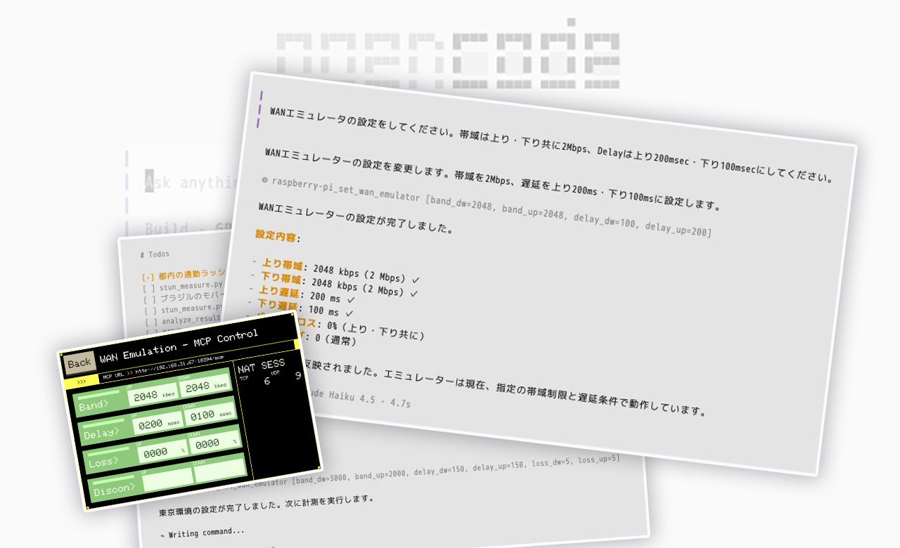
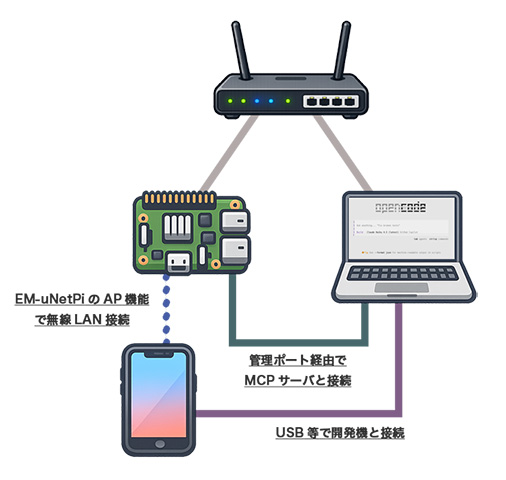

## MCP モードとは？



管理ポート経由でMCPのエンドポイントを公開し、カジュアルにAIエージェントと連携する、それがEM-uNetPiのMCPモードです。

### 機能概要

これまで「Manual Mode」では人手でWANエミュレーションの操作を行っていたが、MCPモードでは、AIエージェント経由でこれまで手動で行っていた設定と同等のことが行えます。

実装の背景や、活用例に関しては、JANOG57.5で行ったプログラム資料を参照ください。

- [JANOG57.5 LT講演「AIエージェント × WANエミュレータによるゲームネットワーク検証の自動化」](https://www.janog.gr.jp/meeting/janog57.5/doc/janog57_5_lt03.pdf)

### 使用方法

#### EM-uNetPi側

起動後「API Mode」に遷移しておいてください。

タイトルヘッダーの下にMCPのエンドポイントが表示されるので、メモします。
特に修正を加えてなければ、「 http://192.168.31.67:10394/mcp 」となります。

> このモードに入っていないと、内部で起動しているMCP-Serverから、EM-uNetPiの操作が行えません。

#### AIエージェント側

任意のAIエージェントでMCPの設定を行った上で、起動します。
出来ることそのものは、従来手動で行っていたことと大差ありません。

__ネットワークの構成として、管理ポートに繋ぐ必要があることには注意してください。__
多くの構成では、AIエージェントを動作させるデバイスに追加でNICを用意し、192.168.31.xxx/24 のアドレスを手動で設定する必要があるでしょう。

また、 __WANエミュレーション環境下で行う検証プログラムを実行するデバイスは、AIエージェントを動作させるデバイスと分けることを奨励します。__ なぜなら、特に意識しないと、クラウドLLMとの通信がWANエミュレーション経由になってしまい、テスト中のAIエージェントの動作自体も怪しくなってしまうからです。

##### （参考）検証時の構成例



##### （参考）AIエージェントへの指示例文

```
WANエミュレーターで出来ることを教えてください。
```

```
WANエミュレーターの現在の設定値を確認してください。
```

```
WANエミュレーターの設定を初期化してください。
```

```
WANエミュレータの設定をしてください。帯域は上り・下り共に2Mbps、Delayは上り200msec・下り100msecにしてください。
```

```
都内の通勤ラッシュ時の電車内を想定した、モバイル回線の通信環境をWANエミュレータに設定してください。
```

````
都内の通勤ラッシュ時の電車内を想定した、モバイル回線の通信環境をWANエミュレータに設定してください。
その後、以下のプログラムを呼び出して計測を行ってください。
```
ping -c 4 github.com
```
計測が終わったら、WANエミュレータの設定を初期状態に戻してください。
````

##### （参考）OpenCodeでのMCP設定例

opencode.jsonc 等へ、下記のような定義を加える。

```json
{
  "$schema": "https://opencode.ai/config.json",
  "mcp": {
    "raspberry-pi": {
      "type": "remote",
      "url": "http://192.168.31.67:8000/mcp",
      "enabled": true,
      "oauth": false
    }
  }
}
```
