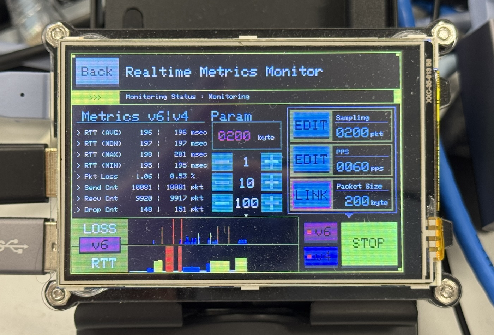
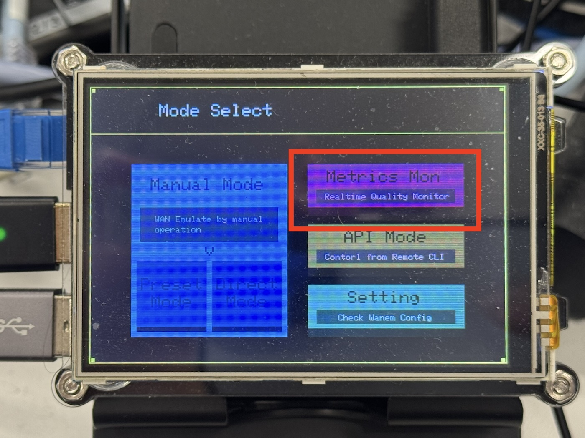
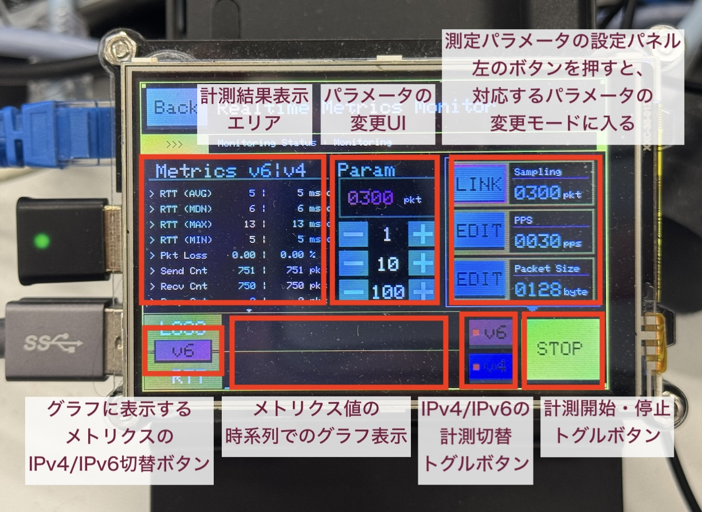

# Metrics Monitor

## Metrics Monitor 機能とは？



カジュアルにリアルタイム通信を行うゲームを想定した回線の品質を測定するための機能、それがMetrics Motnitor機能です。

#### 機能概要

UDPによるクライアント・サーバ間でのPing（所謂UDPing）を行い、その結果から得られる、遅延・パケットロスのメトリクス情報を確認できます。

パケットの送信頻度・パケットサイズが調整可能となっており、よりゲームに近い通信による計測が可能になっています。

また、IPv4/IPv6それぞれ、ないし同時並列での計測も可能です。

#### 登場背景

ゲーム向けのネットワーク品質計測にはいくつか課題があります。

- 多くの開発現場やユーザ環境において、シンプルにPingのようなツールでの計測での判断が行われることが多く、オンラインゲーム向けの品質測定としては不十分であるケースが多い
- ゲーム業界・通信業界それぞれを跨いで、共通で、誰でも扱える計測プログラムがあまり存在しない。そのため、同じ指標で議論を行うことが困難である事が多い
- 十分な検証を行わずに「IPv6の方がIPv4より早い」「現状IPv4で困っていないので、トラブルを招くIPv6はオフにすべき」といった判断がなされるケースが散見されており、よりよりオンラインゲーム体験を実現できる可能性が失われている

これらの課題を各業界・立場の人がカジュアルに解決してゆくために、この計測機能を制作しました。

#### 使用例

- オンラインゲームプレイを想定した回線の遅延・パケットロスの品質を、よくあるSpeedtestのような感覚で測定する
- ゲームプレイ中にラグが発生した場合に、自身の回線による問題なのかを判断するために、ゲームプレイの横で計測を同時に実行する
- IPv4とIPv6の通信品質差をチェックするために、IPv4/IPv6並列で、計測を実行する。結果に応じて、ルータのWAN側の設定や、IPv6-mostlyの設定を調整し、最適な通信経路でのゲームプレイ環境を構築する

### 事前準備

#### プログラムの更新

[FirstStep.md](FirstStep.md) で示した手順で管理ポートからログインし、下記の手順で、最新版へ更新（指定バージョンでcheckoutしたい場合は「v2.1.0」を指定してください）。

```bash
$ sudo pi
$ cd ~/EM-uNetPi
$ git pull
```

#### サーバの準備

「[測定サーバについて](測定サーバについて)」の項目に記載に従って、サーバを構築する。

> 将来的に、パブリックな測定サーバが提供された場合は、そちらを指定しても良い。

#### 設定ファイルの更新

配布イメージのデフォルトの状態では通信先が設定されておらず、この状態のまま起動しても、メニュー画面でMetrics Monitor Mode はグレーアウトされ選択できない。任意の測定サーバを構築の上、DataAsset.py の下記記載の場所にある metricsServer 変数にそのアドレス情報をセットすると、メニューが選択可能になる。

そのため、上記で準備したサーバに割り当てたドメインを設定ファイルに追記する。

```python
        #
        # Metrics Motnitor Config
        #
        self.metricsServer = "" # << ここにドメイン名を設定する
        self.metricsRecvTimeoutMsec = 2000
        self.metricsProcessCycleSec = 300
        self.metricsProcessBinPath  = "/home/pi/EM-uNetPi/tools/StunTool.bin"
```

#### 本体のIPv6の設定を変更

デフォルトではIPv6が無効になっているので、EM-uNetPi起動後に、Setting > IP/NAT の項目から、IPv6 Mode Setting を Disabled から NAT に変更してください（反映には再起動が必要なので注意）。

ちなみに、IPv4での測定のみを行う場合は、この作業は不要です。

### 使い方



正しく事前準備の行程が済んでいれば、起動後のメニューで「Metrics Mon」モードが有効になっているので、そちらをタッチしてモードに入ってください。

#### 画面説明・測定方法



ざっくり説明すると、上記の画像のような形になります。

計測中は、パラメータの変更や計測対象とするアドレスファミリーの変更は行えません。変更したい場合は、一度STOPしてから変更を行なってください。

また、小さいですが、グラフに関してはエリアの上部に現在位置を示すカーソル（▼）が表示されています。

グラフに関しては、品質が良い時は高さがほぼゼロのバーで表示され、品質が悪くなるほど、高さが高いバー（色も赤系）になります。

閾値など、細かい値を自身でカスタムしたい場合は、MetricsGraph.py を修正してください。（閾値調整については、今後プリセット値の用意や変更しやすい形への修正を検討しています。）

> IPv6に関しては、本体のIPv6が無効な場合は測定を有効化できません。

##### 測定方法

各パラーメータの設定、計測するアドレスファミリーの有効・無効を設定したら、右下のSTART/STOPボタンを押してください。

計測が開始すると、左上のMetricsエリアと下部のグラフエリアに測定結果が表示されます（およそ毎秒更新）。

停止したい場合は、右下のSTART/STOPを再度押してください。

##### 右側のパラメータ補足

- Sampling：メトリクスを算出するのに用いる、直近のパケット数。30-999 Packet の範囲で指定が可能。スパイク値を細かく見たい場合は低めの値を奨励。逆に慣らしたい場合は大きめの値を奨励。
- PPS；秒間で送受信するパケット数（例：30で設定すると、毎秒30パケット送信して、30パケット受信する）。対象とするゲームのパケット送信間隔と揃えると、よりゲームに適した測定結果になる。1-60 pps の範囲で指定が可能。
- Packet Size：送受信するパケットサイズ。対象とするゲームのパケットサイズと揃えると、よりゲームに適した測定結果になる。64-1280 byte の範囲で指定が可能。なお、ここでいうサイズは、IPヘッダー + ペイロードの合計サイズを指す（Ehternet Frame Header と FCS は含まない）。

## 測定サーバについて

Metrics Monitor 機能は　STUNプロトコルのPadding Attributeを用いて、Padding Attribute を Echo Back する実装を行なった StunServer との通信を行うことで、遅延・パケットロストの測定を行っている。そのため、通信先には対応する実装を行なった StunServer が必須である。

対応するStunServerソフトウェアは後述するので、自身で計測先を用意する場合には参考にすること。（同等の通信が行われるならば、別のソフトウェアを用いても問題ない）

### サーバの構築方法

STUNプロトコルの Padding Attribute は RTC5780 で定義されているが、フローの過程でどの様に扱われるかについては定義が不十分であり、そのため各実装ごとに扱いがまちまちである。

そのため、ここでは Metrics Monitorと適合するOSS公開されているサーバと対応するパッチを使った構築方法を紹介する。

> 前述の通り、Client が送信した Padding Attribute を Echo Back すればいいので、それに従う実装を用意できるのなら、ここで紹介するプログラムを使用しなくても良い。

#### 1. OSSプログラムの用意

「STUNTMAN - An open source STUN server」の version 1.2.13 をベースに構築する。

Github上では、[jselbie/stunserver](https://github.com/jselbie/stunserver/) として公開されている。

対応バージョンのTagを選びリソースをダウンロード・展開する。

ダウンロード用の参考URL：https://github.com/jselbie/stunserver/archive/refs/tags/version1.2.13.zip

#### 2. パッチを適用する

- /misc/patch/stunserver_padding_echo.patch
  - Padding Attribute が付加されたBinding Requrest に対して、同サイズの Padding Attribute をエコーバックする仕様への変更

- /misc/patch/stunserver_max_msgsize.patch
  - ラージパケットでの測定を可能にするために、扱える Stun Message の最大サイズを引き上げ

を展開先で適用する

#### 3. 構築

オリジナルソースのビルド・実行手順に従い構築する。

#### 4. ドメイン割り当て

サーバのIPにドメインを割り当てる。IPv4のみの測定を行う場合はリテラルのままでも問題ないが、IPv6の測定を行う場合は、A/AAAAレコードの両方をサーバのIPに紐づける必要がある。

#### 補足1： OpenSSLのバージョンによって、ビルドがエラーになる場合

HMAC関係のAPIで破壊的変更があるため、OpenSSLのバージョンによってはビルドに失敗する。

その場合は、2. のパッチを適用後に

- /misc/patch/stunserver_openssl.patch

を追加で適用して、再度ビルドしてください。

#### 補足2：デュアルスタックで Listenするためには...

このサーバプログラムは、デフォルトだとIPv4 onlyモードで起動する。

> --family IPVERSION

引数オプションを用いることで、アドレスファミリーを指定できるが、デュアルスタックモードが存在しない。

そのため、IPv4 / IPv6 両方の計測を実現するためには、

```bash
$ stunserver --family 4
$ stunserver --family 6
```

のように2プロセス起動する必要がある。詳しくはオリジナルのREADMEを参照。