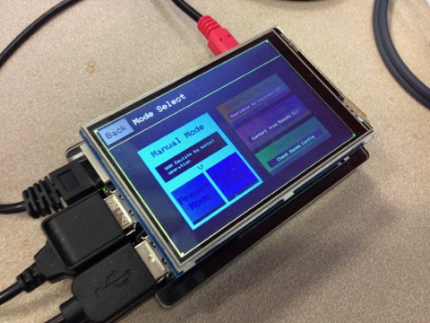
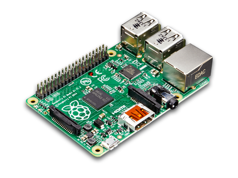
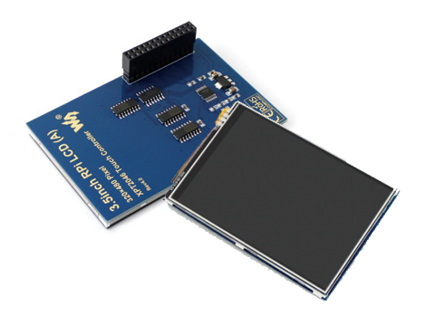
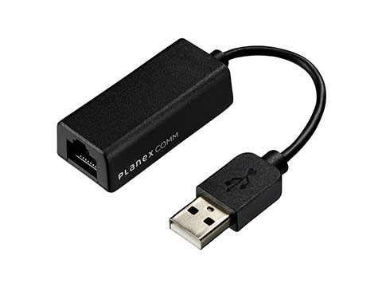
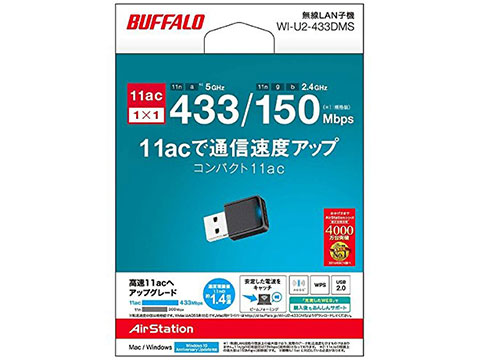

パーツリスト
==================================================================================================

EM-uNetPiのハードウェアは下記のパーツを組み立てることで完成します。

コアパーツ
--------------------------------------------------------------------------------------------------

> 型番違いや、チップが変わった場合、動作しない可能性が高いため、確実に下記と一致するものを使用すること。

#### RaspberryPi 本体

- メーカー：RaspberryPi
- 型番：RaspberryPi 3 Model B or RaspberryPi 3 Model B+
- 数量：1
- 備考：B/B+ いずれでも大丈夫だが、将来的にB+のみ対応にする可能性はある。

#### タッチパネル

- メーカー：cocopar
- 型番：Raspberry pi 2B/3B用 3.5インチ タッチスクリーン TFTモニタLCD
- 数量：1
- 備考：中身が[WaveShareのコレ](https://www.waveshare.com/wiki/3.5inch_RPi_LCD_(A))ならば型番違いでも恐らく大丈夫。

#### 有線LANアダプタ

- メーカー：PLANEX
- 型番：USB-LAN100R USB2.0 LANアダプタ
- 数量：2
- 備考：LAN側インターフェース用と管理ポート用で2つ必要

#### 無線LANアダプタ

- メーカー：BUFFALO
- 型番：WI-U2-433DMS
- 数量：1
- 備考：5GHz向けのAPとして動作させるために必要

> この製品に関しては、生産が終了してしまい、現在入手が困難になりつつある。代替のものに関しては、現在検証をすすめている。

アクセサリ
--------------------------------------------------------------------------------------------------

> アクセサリ類は、RaspberryPi3B+が高負荷状態で稼働できるのに十分な仕様のものを選んでください。

#### 電源アダプタ + ケーブル + 電源スイッチ

- 5V/2.5A以上出力対応のアダプタ
- 電圧降下があまりないケーブル
- 抜き差しによるコネクタ劣化を防ぐためのUSB電源スイッチ

> Raspberry Pi 3 が高負荷で動作するのに十分な品質のものを選ぶこと。ここが不十分である場合、動作が不安定になったり、突然再起動が発生したりする。

#### MicroSDカード

- Class10以上、MLC採用製品奨励
- 最低8GBでも大丈夫だが、ReplayMode用のデータ同期やパケットキャプチャを行う場合にディスク容量が必要となるため、大きめの容量のものを使用することを奨励

> あまり品質のよくないSDカードを使用した場合、動作が不安定になったり、突然再起動が発生したりする。

#### 本体ケース

- タッチパネルに干渉しないものであれば、任意のものでよい

#### ヒートシンク

- 連続稼働時に熱をもつため、RaspberryPi本体に適合する任意のものを購入し、使用することを奨励

#### 感圧式対応 タッチペン

- タッチパネル操作が細かいため、あった方がよい。

> 最近のスマートフォン向けの静電容量式用のものではなく、感圧式向けのものを使用すること。

