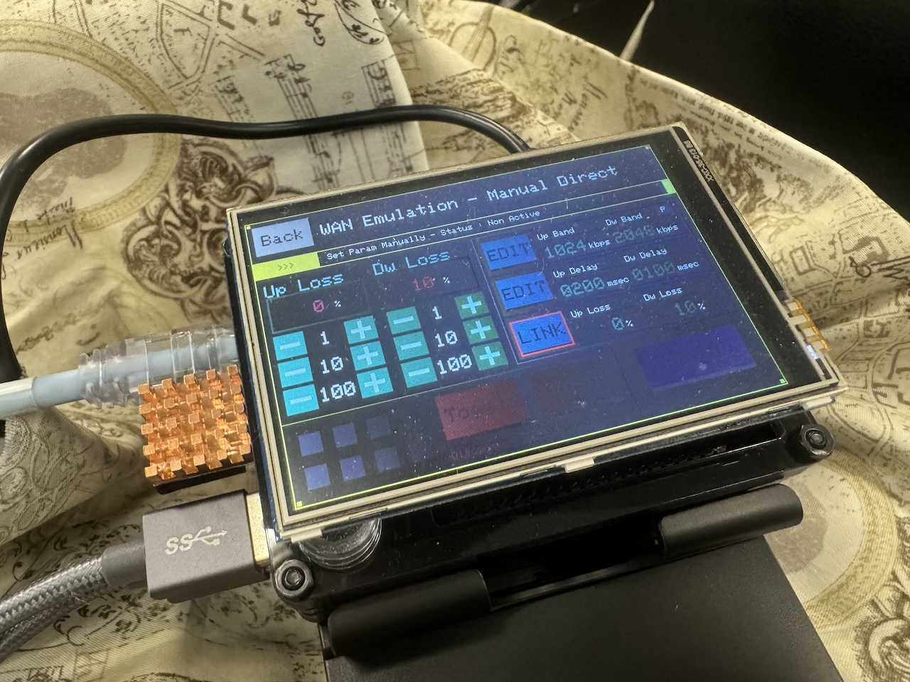
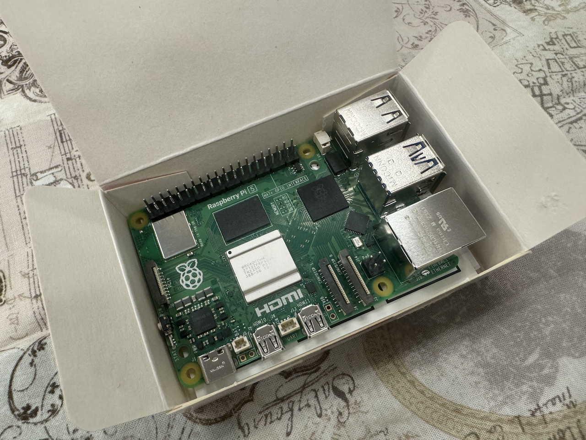

EM-uNetPi for Raspberry Pi 5 構成パーツ
==================================================================================================

EM-uNetPiのハードウェアは下記のパーツを組み立てることで完成します。

コアパーツ
--------------------------------------------------------------------------------------------------

> 型番違いや、チップが変わった場合、動作しない可能性が高いため、確実に下記と一致するものを使用すること。

#### RaspberryPi 本体

- メーカー：Raspberry Pi
- 型番：Raspberry Pi 5
- 数量：1
- 備考：メモリ容量は2GB/4GB/8GB どのモデルでも問わない。

> 最近のロットだと、下図の様に基盤の淵が微妙に膨らんでいることがある。
>
> これだと、ケースによってはそこがつっかえてうまく入らないことがある。そのため、そういう基盤を引いてしまった場合は膨らんでいる部分をヤスリなどで削ってください。

#### タッチパネル

- メーカー：Waveshare
- 型番：3.5inch RPi LCD (A), 480x320
- 数量：1

#### 有線LANアダプタ

- メーカー：PLANEX

- 型番：USB-LAN2500R2

- 数量：2

>  LAN側インターフェース用と管理ポート用で2つ必要

#### 無線LANアダプタ

- メーカー：TP-Link
- 型番：Archer TX20U Nano
- 数量：1

> チップが RTL8852bu 系のものなら、他のものでも代用可能。

アクセサリ
--------------------------------------------------------------------------------------------------

#### 5V5A対応 電源アダプタ

- メーカー：スイッチサイエンス

- 型番：ラズパイ5に最適なACアダプター 5.1V/5.0A USB-PD Type-Cコネクタ出力 / SSCI-093453
- 数量：1

> 5V5Aで適切に出力可能であれば、上記以外でも可。カタログスペックだけだと、実測値で足りてないものもあるため、信頼できるブランドの製品を奨励

#### MicroSDカード

- Class10以上、MLC採用製品奨励
- 最低16GBでも大丈夫だが、ReplayMode用のデータ同期やパケットキャプチャを行う場合にディスク容量が必要となるため、大きめの容量のものを使用することを奨励

> あまり品質のよくないSDカードを使用した場合、動作が不安定になったり、突然再起動が発生したりするため、メジャーブランド品を奨励

#### 本体ケース

- ファン付きで、GPIOにアクセスでき、タッチパネルを取り付けられるような形状のものであれば任意のもので可
  - Raspberry Pi 5 の発熱量の都合上、ファンなしでの運用は非奨励

#### GPIO エクステンダー：連結ピンソケット 2×20(40P) ラズパイ用スタッキングコネクタ

- ファン付きケースを用いる場合、高さの問題でタッチパネルがそのままでは刺さらないことが多い。そのため、スタッキングコネクタ等をつかって持ち上げてあげる必要がある。一般的な Raspiberry Pi 用のパーツなので、任意で探してください。

#### タッチパネル用スペーサー

- メーカー：3M

- 型番：しっかりつくクッションゴム（CS-05）
- 数量：1

> ケースから浮いたタッチパネルの四隅を安定させられるものであれば、なんでも代用可能

#### ヒートシンク

- 連続稼働時に熱をもつため、RaspberryPi本体に適合する任意のものを購入し、使用することを奨励

> ケースに付属することもあるので、それを使っても可

#### 感圧式対応 タッチペン（任意）

- タッチパネル操作が細かいため、あった方がよい。

> 最近のスマートフォン向けの静電容量式用のものではなく、感圧式向けのものを使用すること
>
> タッチパネルに付属することもあるので、それを使っても可

#### キャリングケース（任意）

- メーカー：SANWA SUPPLY

- 型番：IN-HDAD4BK
- 数量：1

> 持ち運びや収納時にあると便利
